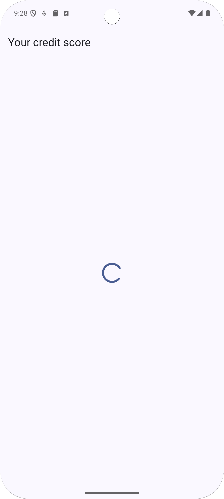
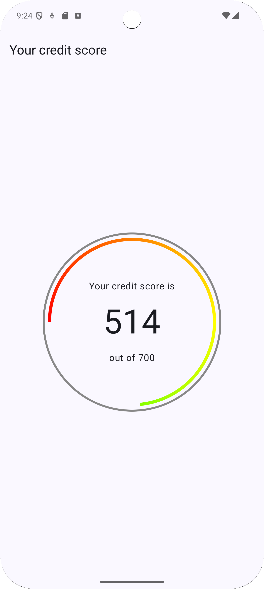
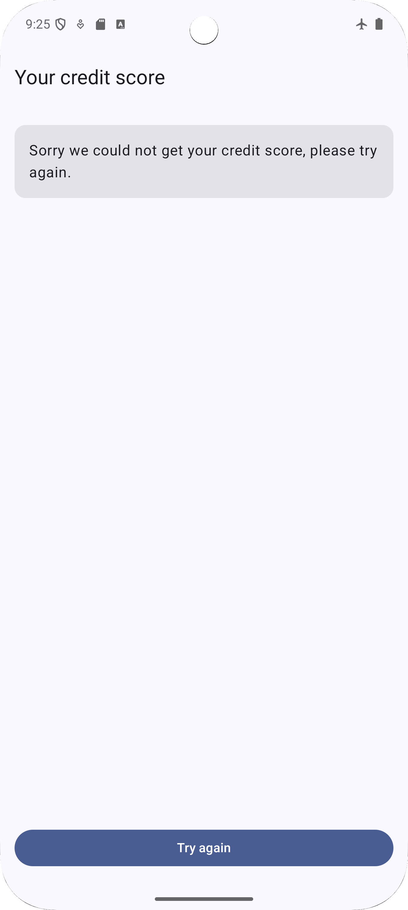

# Drive Score Technical Test - Android

## Overview

This project is a technical test implementation for **Drive Score**, developed in Android Studio Narwhal 2025.1.2, demonstrating modern Android app architecture, best practices, and fully tested features using Kotlin and Jetpack Compose.

---

## Screenshots

| Loading screen                               | Success screen                               | Error screen                             |
|----------------------------------------------|----------------------------------------------|------------------------------------------|
|  |  |  |

---

## Features

- Fetch and display data from a remote API using **Retrofit**.
- JSON parsing with **Moshi**.
- **Dependency Injection** via **Dagger Hilt**.
- **Modern UI** with **Jetpack Compose**.
- **MVI (Model-View-Intent)** architecture for unidirectional data flow.
- **Navigation Compose** with **Kotlin Serialization**.
- Fully tested with **unit tests** (`JUnit`, `MockK`, `Turbine`) and **UI tests** for all main scenarios.

---

## Architecture

- **MVI (Model-View-Intent)** for predictable state management.
- **Repository pattern** for clean data handling.
- **Single Source of Truth** ensures consistency across the app.

---

## Tech Stack

- **Kotlin**
- **Jetpack Compose**
- **Retrofit + Moshi**
- **Kotlin Serialization** (for Navigation arguments)
- **Dagger Hilt**
- **Navigation Compose**
- **JUnit + MockK + Turbine**

---

## Running Tests from Command Line

You can run the tests without opening Android Studio using Gradle commands:

### Unit Tests
```bash
./gradlew testDebugUnitTest
```

### UI Tests
```bash
./gradlew connectedDebugAndroidTest
```

These commands will execute all tests for the debug variant.

---

## Testing

- Unit tests cover repositories, view models, and MVI state logic.
- UI tests cover error, loading and success cases.
- CI workflow runs all unit and UI tests automatically on push.

---

## Notes

- Fully reactive **MVI architecture** ensures a clean and maintainable codebase.
- All scenarios, including loading, error, and empty states, are thoroughly tested.
- I have added custom accessibility for the Doughnut composable in [YourCreditScoreSuccessScreen.kt](app/src/main/java/com/jdp/drivescoretechnicaltest/yourcreditscore/ui/composable/YourCreditScoreSuccessScreen.kt). I have tested the correct accessibility string is formed in the UI test section.
- I have added a workflow file that runs unit and UI tests automatically.
  
---

## Looking Forward
- Animate the inner line of the doughnut chart.
- Ensure TalkBack focuses on the top app bar automatically.
- Modularize the doughnut feature into its own package for reusability.
